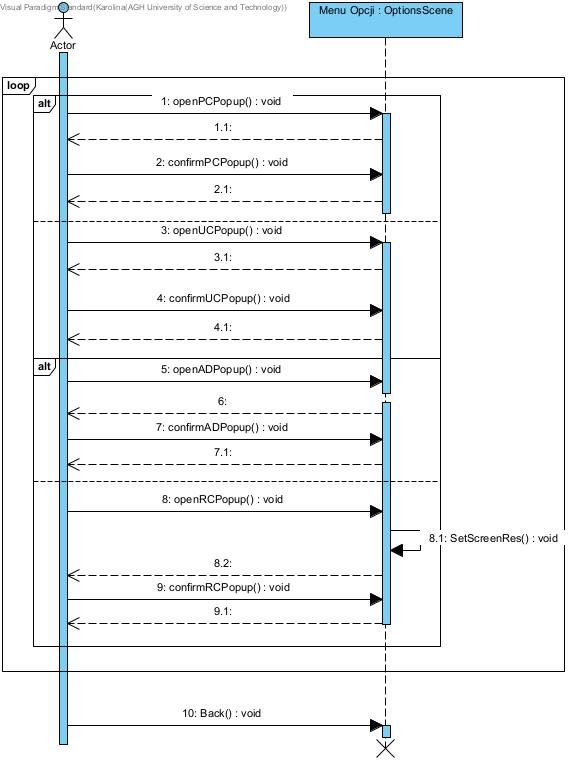
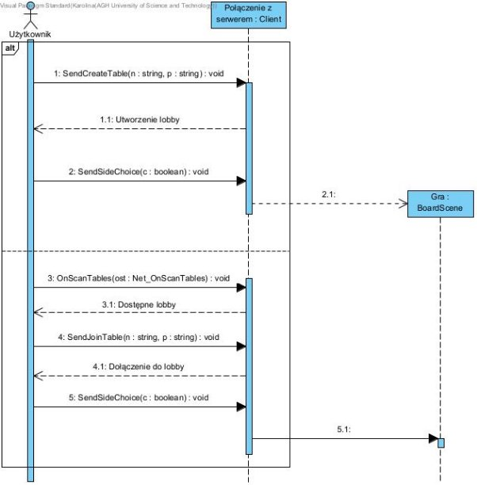

Warcaby![ref1]![ref1]

**Autorzy**

Jakub Szewel, Adam Turczyński, Karolina Wójcik

Spis treści

[**Spis treści](#_page1_x72.00_y72.00) **[2**](#_page1_x72.00_y72.00)**

[**Specyfikacja projektu](#_page3_x72.00_y72.00) **[4** ](#_page3_x72.00_y72.00)[Koncepcja systemu](#_page3_x72.00_y104.45)** [4 ](#_page3_x72.00_y104.45)[Opis](#_page3_x72.00_y230.88) [4 ](#_page3_x72.00_y230.88)[Podział](#_page3_x72.00_y465.14) [4 ](#_page3_x72.00_y465.14)[Przepływ danych](#_page3_x72.00_y553.94) [4 ](#_page3_x72.00_y553.94)[Poziom 0](#_page3_x72.00_y599.10) [4 ](#_page3_x72.00_y599.10)[Poziom 1](#_page4_x72.00_y72.00) [5 ](#_page4_x72.00_y72.00)[Rejestracja](#_page4_x72.00_y332.74) [5 ](#_page4_x72.00_y332.74)[Logowanie](#_page5_x72.00_y72.00) [6 ](#_page5_x72.00_y72.00)[Rozgrywka Online](#_page5_x72.00_y330.49) [6](#_page5_x72.00_y330.49)

[**Wybrana metodyka wytwarzania](#_page5_x72.00_y579.03) **[6** ](#_page5_x72.00_y579.03)[Słownik pojęć i terminów](#_page6_x72.00_y144.73) [7**](#_page6_x72.00_y144.73)**

[**Diagram przypadków użycia](#_page7_x72.00_y72.00) **[8** ](#_page7_x72.00_y72.00)[Opis przypadków użycia](#_page7_x72.00_y335.18)** [8](#_page7_x72.00_y335.18)

[**Wymagania](#_page9_x72.00_y72.00) **[10** ](#_page9_x72.00_y72.00)[Wymagania funkcjonalne](#_page9_x72.00_y104.45)** [10 ](#_page9_x72.00_y104.45)[Wymagania niefunkcjonalne](#_page10_x72.00_y72.00) [11](#_page10_x72.00_y72.00)

[**Wykaz zastosowanych technologii](#_page10_x72.00_y569.14) **[11** ](#_page10_x72.00_y569.14)[Unity](#_page10_x72.00_y621.58)** [11 ](#_page10_x72.00_y621.58)[C#](#_page11_x72.00_y72.00) [11 ](#_page11_x72.00_y72.00)[Visual Studio](#_page11_x72.00_y171.89) [12 ](#_page11_x72.00_y171.89)[Blender](#_page11_x72.00_y318.87) [12 ](#_page11_x72.00_y318.87)[UnityEngine.Networking](#_page11_x72.00_y407.67) [12](#_page11_x72.00_y407.67)

[**Diagramy aktywności](#_page12_x72.00_y72.00) **[13** ](#_page12_x72.00_y72.00)[Rejestracja](#_page12_x72.00_y104.45)** [13 ](#_page12_x72.00_y104.45)[Utworzenie konta](#_page13_x72.00_y72.00) [14 ](#_page13_x72.00_y72.00)[Logowanie się do konta](#_page14_x72.00_y72.00) [15 ](#_page14_x72.00_y72.00)[Zarządzanie ustawieniami](#_page15_x72.00_y72.00) [16 ](#_page15_x72.00_y72.00)[Tworzenie rozgrywki z graczem](#_page16_x72.00_y72.00) [17 ](#_page16_x72.00_y72.00)[Rozgrywka z graczem](#_page17_x72.00_y72.00) [18 ](#_page17_x72.00_y72.00)[Czat](#_page18_x72.00_y72.00) [18 ](#_page18_x72.00_y72.00)[Wyświetlanie reklam](#_page19_x72.00_y72.00) [20](#_page19_x72.00_y72.00)

[**Diagram klas](#_page20_x72.00_y72.00) **[21**](#_page20_x72.00_y72.00)**

[**Diagramy sekwencji](#_page24_x72.00_y72.00) **[25** ](#_page24_x72.00_y72.00)[Rejestracja](#_page24_x72.00_y104.45)** [25 ](#_page24_x72.00_y104.45)[Logowanie się do konta](#_page24_x72.00_y386.63) [25 ](#_page24_x72.00_y386.63)[Zarządzanie ustawieniami](#_page25_x72.00_y72.00) [26](#_page25_x72.00_y72.00)

[Tworzenie rozgrywki z graczem](#_page26_x72.00_y72.00) [27 ](#_page26_x72.00_y72.00)[Rozgrywka z graczem](#_page27_x72.00_y72.00) [28 ](#_page27_x72.00_y72.00)[Czat](#_page27_x72.00_y415.68) [28 ](#_page27_x72.00_y415.68)[Wyświetlanie reklam](#_page28_x72.00_y72.00) [29](#_page28_x72.00_y72.00)

[**Diagram komponentów](#_page28_x72.00_y310.39) **[29** ](#_page28_x72.00_y310.39)[Diagram wdrożenia](#_page29_x72.00_y72.00) [30**](#_page29_x72.00_y72.00)**

[**Przykłady współpracy](#_page29_x72.00_y459.68) **[30** ](#_page29_x72.00_y459.68)[Trello](#_page29_x72.00_y512.13)** [30 ](#_page29_x72.00_y512.13)[GitHub](#_page30_x72.00_y86.55) [31](#_page30_x72.00_y86.55)

[**Testy jednostkowe](#_page31_x72.00_y72.00) **[32** ](#_page31_x72.00_y72.00)[Refaktoryzacja kodu](#_page32_x72.00_y585.83) [33** ](#_page32_x72.00_y585.83)[Wzorce projektowe](#_page36_x72.00_y323.71) [37** ](#_page36_x72.00_y323.71)[Instrukcja użytkowania](#_page36_x72.00_y579.80) [37** ](#_page36_x72.00_y579.80)[Podsumowanie](#_page40_x72.00_y72.00) [41**](#_page40_x72.00_y72.00)**

Specyfikacja projektu

Koncepcja systemu

Projekt ten miał być nową odsłoną klasycznej gry warcaby, odzwierciedlającym jej podstawowe zasady. Dzięki połączeniu internetowemu użytkownicy mogą łączyć się z dowolnego miejsca na świecie i grać ze sobą w warcaby.

Jeżeli chodzi o część wizualną, to zdecydowaliśmy się na model 3D - dużo wersji warcabów online jest w wersji 2D, więc ten projekt dodaje trochę świeżości do tej klasycznej gry.

Opis

Warcaby są grą napisaną w języku C# w silniku gry Unity. Możliwe jest założenie konta oraz zalogowanie się do niego, dzięki czemu mamy dostęp do rozgrywki online.

Użytkownik może grać z innymi użytkownikami - każda gra rozgrywa się na podstawie ogólnych zasad gry w warcaby - białe pionki zaczynają, pionki mogą poruszać się tylko na skos i do przodu o jedno miejsce, pionek zbije inny pionek jeżeli przejdzie na miejsca za nim, bicie jest wymuszone, pionki po przejściu na drugi koniec planszy zmieniają się w królówkę, wtedy ich zakres ruchu jest zwiększony oraz mogą poruszać się w każdą stronę.

Podczas gry z innymi użytkownikami dostępny jest czat - miejsce gdzie gracze mogą się ze sobą komunikować w czasie rzeczywistym.

Jeżeli użytkownikowi znudzi się jego dotychczasowa nazwa, albo zechce zmienić swoje hasło. to może to zrobić w menu ustawień. Może tam też również zmienić rozdzielczość gry - tak, by była dopasowana do jego monitora lub upodobań.

Podział

System dzieli się na dwie części - część z której może korzystać użytkownik oraz serwer - podmiot odpowiedzialny za nawiązanie i utrzymanie połączenia między użytkownikami. Istnieje jeszcze baza danych, która przechowuje dane użytkownika.

Przepływ danych

Poziom 0

Poziom 1

Rejestracja

Logowanie

Rozgrywka Online

Wybrana metodyka wytwarzania

Do naszego projektu wybraliśmy iteracyjny model wytwarzania. Jest to metoda wytwarzania polegająca na tym, że projekt jest podzielony na większą liczbę iteracji. Każda iteracja stanowi zamknięty cykl wytwórczy dający w wyniku działającą wersje produktu będącą podzbiorem finalnego produktu, który rozrasta się z iteracji na iteracja aż do produktu końcowego.

Ten model był bardzo odpowiedni do naszego projektu, ponieważ musieliśmy tworzyć funkcjonalności po kolei i każda musiała działać w pełni.

Podzieliliśmy projekt na mniejsze części: utworzenie rozgrywki, zarządzanie kontem, rozgrywka online, archiwum gier, wyświetlanie reklam, czas oraz rozgrywka z komputerem. Dzięki podzieleniu tego na takie części, mogliśmy się skupić na udoskonalaniu jednej, aby potem móc już spokojnie przejść do kolejnej, wiedząc że poprzednia jest w pełni funkcjonalna.

Słownik pojęć i terminów

- **Branch** - gałąź, w GitHubie: jest to rozgałęzienie umożliwiające paru użytkownikom pracę nad kodem bez konfliktów. Po zakończeniu danej funkcjonalności to rozgałęzienie może zostać połączone z główną gałęzią.
- **Czat** - funkcjonalność służąca do komunikacji pisemnej pomiędzy dwiema lub więcej osobami w trybie online. Wiadomości są zazwyczaj dość krótkie.
- **Fetch** - W GitHubie, jest to interfejs pozwalający na asynchroniczne pobieranie zasobów
- **Hotseat** - w strategicznych grach turowych, gdzie gracze wykonują swoje posunięcia sekwencyjnie, jest to opcja rozgrywki w której możliwe jest korzystanie z jednego zestawu urządzeń wejścia-wyjścia. W takim trybie gracze wykonują ruchy swojej kolejki jeden po drugim korzystając z jednego komputera.
- **Lobby** - miejsce do którego dołączają graczę by zgrać ze sobą - jest to coś typu stół do gry, tylko wirtualny. W tej dokumentacji jest ono również określane jako **stół**.
- **Multiplayer** - tryb gry pozwalający na rozgrywkę wielu graczy w tej samej grze komputerowej. W tym wypadku grą komputerową są Warcaby.
- **Projekt** - Odniesienie do programu “Warcaby” oraz czynności związanych z wytworzeniem oprogramowania oraz dokumentacji do tego programu.
- **Rozgrywka offline** - jest to rozgrywka, która nie wymaga połączenia z internetem, ani z innym graczem.
- **UI** - Interfejs użytkownika
- **UX** - (ang. User Experience) całość wrażeń, jakich doświadcza użytkownik podczas korzystania z produktu.
- **Użytkownik** - osoba korzystająca lub chcąca korzystać z programu “Warcaby”, czasem określana jako: **gracz, przeciwnik, osoba**.
- **Przeciwnik** - użytkownik programu Warcaby, przeciwko któremu gra osoba również korzystająca z tej aplikacji.
- **Warcaby (z wielkiej litery)** - jest to odniesienie do aplikacji omawianej dokumentacji. Jeżeli jest mowa o warcabach jako ogólnej grze, to są one wtedy pisane z małej litery.

Diagram przypadków użycia

Opis przypadków użycia

**Rejestracja**

Rejestracja umożliwi użytkownikowi utworzenie konta, dzięki czemu będzie mógł się zalogować oraz korzystać z funkcjonalności programu jaką jest gra multiplayer. Do rejestracji będzie wymagane wymyślone przez niego hasło oraz unikatowa nazwa użytkownika. Nazwa musi być poprawna oraz niezarejestrowana w systemie, inaczej rejestracja będzie niemożliwa.

Konto użytkownika po rejestracji musi zostać utworzone. Serwer sprawdza czy dane podane przez użytkownika są prawidłowe i czy nie istnieje już konto o danej nazwie użytkownika.

**Logowanie się do konta**

Funkcjonalność potrzebna do tego, by użytkownik po utworzeniu konta mógł się zalogować do systemu i dzięki temu korzystać z innych opcji oferowanych przez program.

**Zarządzanie ustawieniami**

Użytkownik może zmieniać ustawienia. W tej funkcjonalności może on zmienić swoją nazwę, zmienić swoje hasło, usunąć konto oraz zmienić rozdzielczość, na jedną z trzech dostępnych.

**Tworzenie rozgrywki z graczem**

Użytkownik może stworzyć lobby do którego dołączy inny użytkownik. W tym lobby użytkownicy mogą się porozumiewać za pomocą czatu oraz zmieniać ustawienia rozgrywki, takie jak czas i kto gra którymi pionkami. Aby rozpocząć grę obaj użytkownicy muszą się zgodzić na rozpoczęcie rozgrywki

8
**Czat**

Użytkownicy podczas rozgrywki mogą porozumiewać się ze sobą za pomocą czatu.

**Rozgrywka z graczem**

Rozgrywka z innym graczem pozwoli użytkownikom rozegrać partię warcabów z innymi użytkownikami posiadającymi konto w aplikacji. Możliwa jest gra na czas

**Wyświetlanie reklam**

Reklamy będą mogły być źródłem z którego aplikacja będzie się utrzymywać. Reklamy powinny wyświetlać się w nieagresywny sposób, jednak powinny być na tyle widoczne by zwrócić uwagę użytkownika, jednak nie na tyle by zniechęcać go do korzystania z aplikacji.

9

Wymagania

Wymagania funkcjonalne

10

Wymagania niefunkcjonalne

Wykaz zastosowanych technologii

Unity

Jest to silnik do tworzenia trójwymiarowych oraz dwuwymiarowych gier stworzony przez Unity Technologies. Głównie programuje się w C# używając Mono. Jest to rozbudowane narzędzie, obsługuje wiele platform sprzętowych.

W naszym przypadku używamy Unity do utworzenia gry desktopowej w formie 3D. Ten silnik zawiera wszystkie potrzebne nam narzędzia, dlatego wybraliśmy właśnie ten.

11
C#

Język ten skupia się na programowaniu obiektowym. Program napisany w tym języku kompilowany jest do języka Common Intermediate Language, specjalnego kodu pośredniego wykonywanego w środowisku uruchomieniowym, którym w przypadku tego projektu jest to Mono, używane przez Unity.

Visual Studio

Jest to zintegrowane środowisko programistyczne. Jest to jedno z najpopularniejszych środowisk do programowania, my wybraliśmy je również z tego powodu, że Unity je wspiera.

Program ten oferuje wsparcie dla wielu języków. My akurat korzystaliśmy z C#. Sprawdza działanie programu na bieżąco, dzięki czemu można od razu naprawiać błędy. Jest to również bardzo wygodne narzędzie do pisania testy jednostkowe.

Blender

Jest to darmowy program do tworzenia modeli 3D (i nie tylko). Posłużyliśmy się nim w celu stworzenia modeli planszy i pionków.

UnityEngine.Networking

Jest to biblioteka umożliwiająca stworzenie serwera i zarządzanie nim. W takim celu wykorzystaliśmy ją w naszym projekcie - dzięki niej mogliśmy stworzyć takie funkcjonalności jak rozgrywka online, logowanie oraz rejestracje.

12

Diagramy aktywności

Rejestracja

Tutaj “Analiza danych” jest połączona z diagramem “Utworzenie konta”

13

Utworzenie konta

Logowanie się do konta

Zarządzanie ustawieniami

Tworzenie rozgrywki z graczem

Rozgrywka z graczem

18
Czat

19

Wyświetlanie reklam

20

Diagram klas

**Przybliżenia:**

Diagramy sekwencji

Rejestracja

Logowanie się do konta

Zarządzanie ustawieniami

Tworzenie rozgrywki z graczem

Rozgrywka z graczem

Czat

Wyświetlanie reklam

Diagram komponentów

Diagram wdrożenia

Przykłady współpracy

Trello

Podczas tworzenia projektu, aby zaplanować dokładnie co mamy do zrobienia korzystaliśmy z aplikacji Trello. Dzięki tej aplikacji mogliśmy łatwo zobaczyć co już jest zrobione, co jest w trakcie oraz co musimy jeszcze zrobić.

GitHub

Jest to hostingowy serwis internetowy przeznaczony do projektów programistycznych wykorzystujących system kontroli wersji Git. Dzięki funkcji repozytoriów można łatwo udostępniać kod, co ułatwia pracę nad programem jeżeli tworzy go parę osób.

Dzięki temu narzędziu można szybko wrócić do poprzednich wersji kodu w wypadku, gdy nowe powodują ciężkie do naprawienia błędy.

Ten program oferuje nam również kontrolę wersji - zmiany przechodzą do branch’a main tylko wtedy kiedy zostaną zaakceptowane. Dzięki wizualizacji tego, co zostało zmienione, dodane i usunięte bardzo wyraźnie widać co zostało zrealizowane.

Aby szybko i łatwo pobrać zmiany na komputer, dobrze korzystać z aplikacji GitHub Desktop, dzięki której można łatwo fetch’ować i zastąpić zmienione pliki w komputerze, dzięki czemu nie trzeba ręcznie szukać wprowadzonych zmian.

Testy jednostkowe

Testy jednostkowe to metoda testowania tworzonego oprogramowania poprzez wykonywanie testów, które będą weryfikować poprawność działania pojedynczych elementów programu. W tym przypadku testowaliśmy metody klasy Logic.

Do utworzenia testów jednostkowych w Unity potrzebowaliśmy dodatku “Test Framework”, który domyślnie jest w Unity. Dzięki niemu można bezpośrednio w oknie Unity uruchamiać testy.

Pierwszym przykładem testu jednostkowego jest testowanie funkcji between, która ma sprawdzać, czy a jest pomiędzy x1 a x2.

Drugim przykładem testu jednostkowego jest testowanie funkcji CheckIfInside, która sprawdza czy ruch który chce wykonać gracz nie jest poza planszą.

Wyniki jak funkcje działały by niepoprawnie:

Po naprawieniu jednej z funkcji:

I działające funkcje:

Refaktoryzacja kodu

Refaktoryzacja kodu to technika wykorzystywana w programowaniu polegająca na ogólnej poprawie jakości istniejącego kodu. Zmiany, które pozwolą na uzyskanie lepszej czytelności kodu, ułatwią dodawanie nowych funkcji i umożliwią rozwijanie kodu na szeroką skalę.

Przedstawię przykłady w formie zrzutów ekranu z githuba, dzięki czemu łatwo będzie zauważyć zmiany. Dobrym przykładem refaktoryzacji kodu będzie uporządkowanie pliku Logic.cs, która zajmowała się kontrolą tego, by gra odbywała się według zasad warcabów.

Pierwszy fragment:

Funkcja, która zastępuje te warunki:

Widzimy tutaj zmianę zapisu warunku sprawdzającego czy pionek znajduję się na planszy. Zastąpiliśmy warunek funkcją, dzięki czemu w razie potrzeby zamiast zmieniać ten warunek w każdym miejscu, możemy zmienić funkcję, która jednocześnie zmieni się w innych miejscach programu.

Kolejnym przykładem była zmiana nazewnictwa, tak by była bardziej jednolita. Dobrym tego przykładem jest klasa OptionScene, która przed refaktoryzacją nazywała się opcje.

Tak wyglądał jej stan przed refaktoryzacją:

Jak widzimy, nazewnictwo nie jest spójne, co może przeszkadzać w dalszych próbach rozwijania oprogramowania. Jako że w większości kodu dominują angielskie nazwy, dlatego i tu postanowiliśmy je na takie zamienić.

Stan klasy po refaktoryzacji:

Trzecim przykładem uporządkowanie kodu będzie użycie switch case’a zamiast łańcucha if’ów. Dla takiego przypadku o wiele estetycznej i bardziej przejrzyście jest użyć właśnie formy switch case - osoba, która będzie dalej rozwijać kod połapie się o wiele lepiej w tej wersji.

Wzorce projektowe

W tym projekcie moglibyśmy użyć wzorca projektowego fasady. Jest to strukturalny wzorzec projektowy, który wyposaża złożony zestaw klas, bibliotekę lub framework w uproszczony interfejs.

Nasz projekt posiada wiele różnych funkcjonalności - logowanie, rejestrację, rozgrywkę itp., użytkownikowi może być potrzebny prosty interfejs, w którym może się odnaleźć. Częściowo jest to zapewnione przez sam silnik gry - Unity, jednak również w kodzie mogłyby się znaleźć rozwiązania, które dawałyby wygodny dostęp do funkcjonalności podsystemu.

Nasz system składa się z wielu różnych obiektów - dobrym przykładem tego jest plansza podczas rozgrywki, gdzie każdy pionek jest obiektem. Potem trzeba przechowywać informacje gdzie się znajdują, jakie ruchy są wykonalne oraz czy dostępne są zbicia, które pionki są zwyczajne, a które są królówkami. Jest to rozbudowany podsystem, który znajduje się w dwóch klasach. Do niego moglibyśmy zastosować wzorzec fasady, który podzieliłby te wszystkie funkcjonalności i stworzyć klasę, która byłaby pośrednikiem.

Instrukcja użytkowania

**Zasady gry w warcaby**

Warcaby to gra planszowa na planszy 10x10, w której bierze udział 40 pionów - 20 po stronie białej i 20 po stronie czarnej.

Zwykłe pionki mogą poruszać się o jedno pole do przodu po prawej lub po lewej. Jeżeli na skos od pionka jest inny pionek, a pole za nim (na skos) jest puste, to dany pionek ma wymuszony ruch bicia. Jeżeli po zbiciu pionka może być zbity kolejny pionek, to gracz nie kończy tury i zbija kolejnego pionka.

Jeżeli pionek dojdzie na przeciwległy koniec planszy, to wtedy staje się królówką. Królówka ma rozszerzony zakres ruchów - może poruszać się po wszystkich polach dostępnych na skos (również do tyłu). Tak samo może zbijać inne pionki, nie ważne jak daleko są - ważne jednak, by przynajmniej jedno pole za nimi było wolne - królówka przeskakuje na dowolne z tych pól i może kontynuować bicie (jeżeli jest możliwe).

Gra kończy się, kiedy któryś z graczy nie ma już pionków, albo nie ma żadnych dostępnych ruchów. Wygrywa osoba, która ma pionki na planszy (lub dostępne ruchy).

**Otwieranie aplikacji**

1. Znajdź miejsce gdzie znajduje się aplikacja “Warcaby”. Jeżeli nie wiesz gdzie się znajduje, skorzystaj z wyszukiwarki systemowej.
1. Kliknij dwukrotnie na aplikacje
1. Aplikacja powinna się uruchomić.

**Rejestracja**

1. Po uruchomieniu aplikacji na ekranie pojawią się dwa obszary: jeden ma nad sobą napis “Register”.
1. W pole “Login” wpisz nazwę użytkownika jaką chcesz posiadać.
   1. Jeżeli nazwa użytkownika jest zajęta, wyświetli się komunikat.
   1. W takim wypadku wpisz inną nazwę.
1. W pole “Password” wpisz hasło, jakie chcesz by twoje konto posiadało.
1. Po uzupełnieniu obu pól wybierz opcje “Sign Up”.
1. Jeżeli nie wyświetla się żaden komunikat o niepowodzeniu, to twoje konto zostało utworzone.

**Logowanie**

1. Po uruchomieniu aplikacji na ekranie pojawią się dwa obszary: jeden ma nad sobą napis “Sign in”
1. W pole “Login” wpisz swoją nazwę użytkownika
   1. Jeżeli wpiszesz nazwę użytkownika, która nie istnieje, pojawi się komunikat o tym, że taki użytkownik nie istnieje.
1. W pole “Password” wpisz hasło do swojego konta.
   1. Jeżeli wpiszesz hasło, które nie pasuje do nazwy użytkownika, pojawi się komunikat o tym, że hasło jest niepoprawne.
1. Po uzupełnieniu obu pól wybierz opcję “Sign In”
1. Jeżeli wszystko poszło pomyślnie, zostaniesz przekierowany do menu głównego.

**Zmienianie ustawień**

1. W menu głównym wybierz pole “Options”.
1. Wybranie tego pola przeniesie cię do ekranu zmiany ustawień.
1. Masz do wyboru 5 opcji:
1. Na samej górze “Main menu” - wybranie tego pola przekieruje cię z powrotem do menu głównego
1. Po lewej u góry “Change password” - wybranie tego pola otworzy okienko umożliwiające zmianę hasła
1. Aby zmienić hasło, musisz wpisać swoje stare hasło w pole na górze, a potem nowe hasło w pole na dole. Aby wprowadzić zmiany wybierz opcję “Ok” na dole.
1. Jeżeli chcesz wyjść z tego okienka, to wybierz opcję “Ok”.
3. Po prawej u góry “Change resolution” - wybranie tego pola otworzy okienko umożliwiające zmianę rozdzielczości.
   1. Aby zmienić rozdzielczość, wybierz jedną z opcji która nie jest polem “Ok”.
   1. Jeżeli chcesz wyjść z okienka, to wybierz opcję “Ok”.
3. Po lewej na dole “Change username” - wybranie tego pola otworzy okienko umożliwiające zmianę nazwy użytkownika
   1. Aby zmienić nazwę użytkownika, musisz wpisać swoje hasło w pole na górze, a następnie nową nazwę użytkownika w pole na dole. Aby wprowadzić zmiany wybierz opcję “Ok” na dole.
   1. Jeżeli chcesz wyjść z tego okienka, to wybierz opcję “Ok”.
3. Po prawej na dole “Delete account” - wybranie tego pola otworzy okienko umożliwiające usunięcie konta.
1. Aby usunąć konto, musisz wpisać swoją nazwę użytkownika w pole na górze, a następnie swoje hasło w pole na dole. Aby wprowadzić zmiany wybierz opcję “Ok” na dole.
1. Jeżeli chcesz wyjść z tego okienka, to wybierz opcję “Ok”.

**Tworzenie lobby**

1. W menu głównym wybierz opcję “Play”.
1. Po przekierowaniu dalej wybierz opcję “Multiplayer”
1. Po przekierowaniu dalej w prawym górnym rogu zobaczysz dwa pola: Table1 i password.
1. W te pola wpisz dane.
1. Aby utworzyć stół wybierz opcję “Create Table”.
1. Lobby zostało utworzone.

**Dołączanie do lobby**

1. W menu głównym wybierz opcję “Play”.
1. Po przekierowaniu dalej wybierz opcję “Multiplayer”
1. Po przekierowaniu dalej w prawym dolnym rogu wybierz opcje “Scan for tables”
1. Na środku powinny pojawić się dostępne stoły - jeżeli nic się nie pojawiło, to znaczy że żadne stoły nie zostały stworzone.
1. Aby dołączyć do danego stołu, wybierz go z listy.
1. Wpisz hasło do stołu.
1. Dołączono do stołu.

**Gra Multiplayer**

1. Aby gra multiplayer się rozpoczęła, trzeba dołączyć do lobby - jest to opisane w punkcie “Dołączanie do lobby”
1. Po dołączeniu do lobby może pojawić się opcja wyboru koloru oraz tego czy gra ma być na czas.

a. Jeżeli użytkownik wybierze opcję gry na czas, to może wybrać trzy możliwe warianty:

1. 3 minuty
1. 5 minut
1. 10 minut.
3. Przynajmniej jedna z dwóch osób w lobby musi wybrać kolor by gra się rozpoczęła.
4. Po wybraniu koloru gracze są przekierowywani do rozgrywki - na ekranie powinna pojawić się plansza.
4. Gracze mają teraz opcje rozmawiania ze sobą za pomocą czatu - korzystanie z niego jest opisane w punkcie “Korzystanie z czatu”.
4. Zaczyna strona biała.
4. Gracze wykonują ruch poprzez kliknięcie na pionek oraz kliknięcie w jedno z pól zaznaczonych przez zieloną kropkę.
   1. Jeżeli nie wyświetlają się żadne znaczniki, to oznacza że dany ruch jest niemożliwy, lub że jest tura przeciwnika.
   1. Gracz może mieć wiele ruchów w jednej turze jeżeli zbił piona i może zbić kolejne.
4. Gra odbywa się zgodnie z zasadami warcabów omówionych w punkcie “Zasady gry w warcaby”.
4. Gra kończy się jeżeli:
1. Nie ma dostępnych ruchów.
1. Któryś z graczy nie ma pionków.
1. Skończył się czas.

10\.

**Korzystanie z czatu**

1. Aby korzystać z usługi czatu trzeba być w rozgrywce multiplayer.
1. W oknie czatu wpisz wiadomość.
1. Po wpisaniu wiadomości wybierz opcje wysyłania wiadomości.
1. Wiadomość powinna zostać wysłana do użytkownika
   1. Pojawi się w oknie czatu.
1. Jeżeli przeciwnik wysłał wiadomość, powinna się ona pojawić w oknie czatu.

**Gra offline**

1. Aby zagrać w warcaby na jednym urządzeniu:
1. Grasz bez logowania
   1. Wybierz opcję “Play offline”
1. Grasz logując się do konta

i. Zaloguj się

2. Powinno nastąpić przekierowanie do menu głównego.
2. Wybierz opcję “Play”.
2. Wybierz opcję “Hotseat”.
2. Możesz teraz grać w warcaby na jednym urządzeniu.

**Zamykanie aplikacji**

1. Aby zamknąć aplikację przejdź do menu głównego.
1. Wybierz opcję “Exit Game”.
1. Aplikacja została zamknięta.

Podsumowanie

**Ogólne wrażenia po projekcie**

Podczas realizacji tego projektu zdobyliśmy wiele umiejętności, które będą użyteczne w dalszej karierze. O wiele swobodniej poruszamy się teraz w środowisku Unity, a co za tym idzie również w języku C#.

Unity dało nam dostęp do wielu narzędzi, które umożliwiły nam stworzenie tej gry. Bez tego narzędzia bardzo trudno by to było zrobić w formie 3D. Ten silnik gry ma dość rozległą dokumentacje i całkiem sporą społeczność programistów realizującą swoje projekty w nim, dzięki czemu zawsze można szukać pomocy w rozwiązywaniu napotkanych problemów.

Dzięki pisaniu dokumentacji zdobyliśmy dużo wiedzy o tym, jak powinna ona wyglądać. Diagramy pozwoliły w wizualny sposób zaprezentować działanie całego środowiska oraz to jak różne elementy ze sobą oddziałują.

**Opis prac**

Na początku zaplanowaliśmy jak powinien wyglądać projekt oraz co będziemy potrzebować. Następnie zapisaliśmy jakie funkcjonalności będą potrzebne by projekt działał w pełni. Ostatnim etapem przygotowań było ustalenie co powinno się znaleźć w dokumentacji i jak powinna być zrobiona.

Po dokonaniu prac przygotowawczych rozdzieliliśmy między sobą pracę oraz kto jest za co odpowiedzialny. Jak już każdy wiedział co ma robić to przeszliśmy do realizacji przydzielonych zadań.

Kod był tworzony w regularnych odstępach czasu. Dokumentacja była tworzona równolegle z kodem, dzięki czemu łatwiej było zwizualizować działanie kodu oraz opisanie go.

**Napotkane problemy**

Sama praca nad projektem była dość wyczerpująca przez ilość funkcjonalności jakie miały zostać wprowadzone w połączeniu z nakładem pracy związanym ze studiowaniem.

Sama mechanika gry zajęła bardzo dużo czasu przez wiele czynników wynikających z zasad gry w warcaby. Sprawdzanie czy dane ruchy są legalne i czy nie ma może wymuszonego bicia jest dość skomplikowane, ale ostatecznie wszystko działa poprawnie.

Dużym problemem było wprowadzenie AI do naszej wersji gry, głównie stworzenie analizy planszy przez komputer sprawiło trudności, dlatego ostatecznie nie udało się wprowadzić tej funkcjonalności.

**Funkcjonalności wyróżniające rozwiązanie**

Najbardziej wyróżniającym elementem tego programu wśród innych odmian warcabów jest jest jego oprawa wizualna - rzadko spotyka się wśród warcabów online grafikę 3D, zazwyczaj są one dwuwymiarowe.
41

[ref1]: Images/Aspose.Words.7ba5a526-125f-4f09-8c1b-b59e6a0b25b9.001.png
